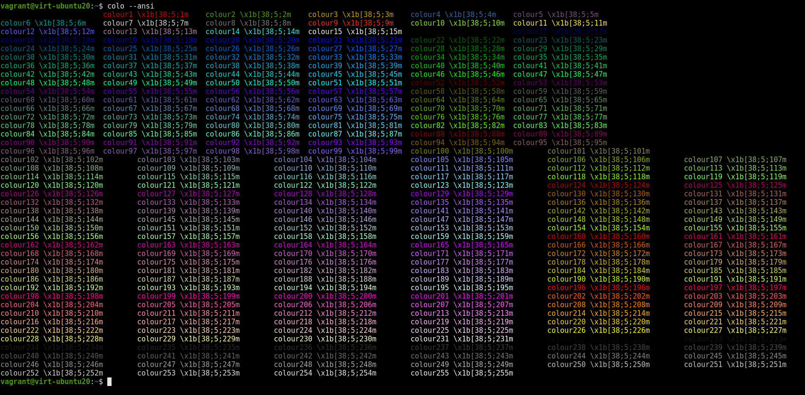

# colo

A simple script that prints out the 256 terminal colors in different formats:</br>
It can print the numbers, the hex value, rgb,hsi and the ansi escape sequence.</br>

```sh
colo --help
usage: colo [-h] [--ansi] [--hsi] [--rgb] [--number] [--name] [--hex]

optional arguments:
  -h, --help  show this help message and exit
  --ansi      bool
  --hsi       bool
  --rgb       bool
  --number    bool
  --name      bool
  --hex       bool
```



## How to get
```sh
pip3 install colo
```
